# TicTacToang Architecture Diagrams

These Mermaid diagrams reflect the current repository structure in `frontend/src` and `backend/src`. Older image diagrams were used only as architectural reference; this document favors the current file and folder names in the repo.

## 1. High-Level Container Architecture Diagram

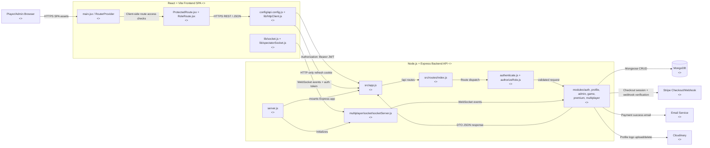

## 2. High-Level Frontend Component Diagram

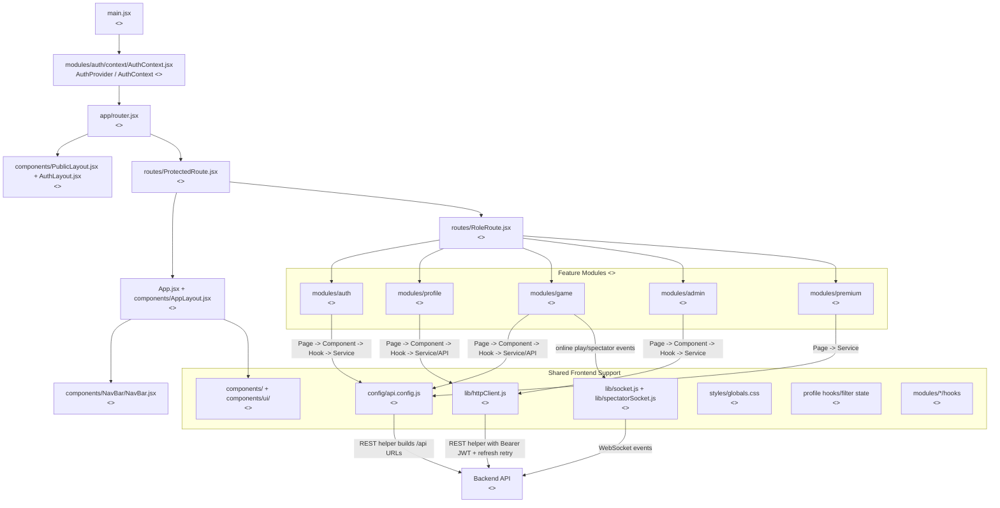

## 3. High-Level Backend Component Diagram

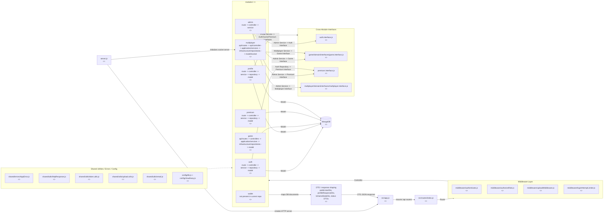

## 4. Low-Level Frontend Module Diagrams

### Auth Module

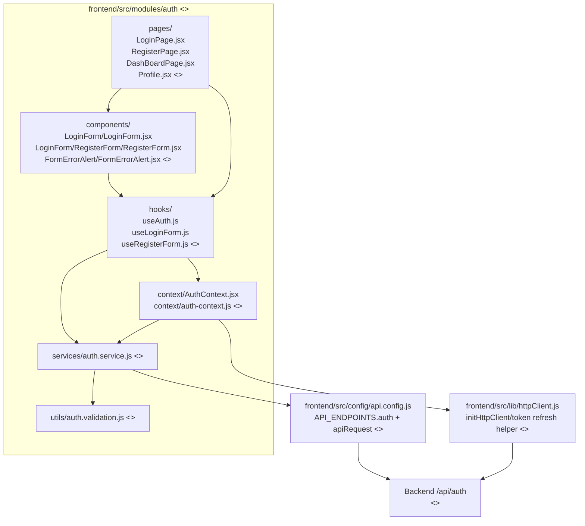

### Profile Module

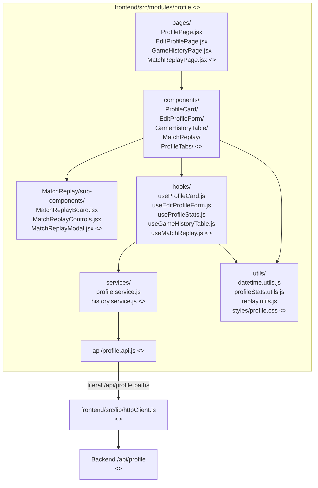

### Game Module

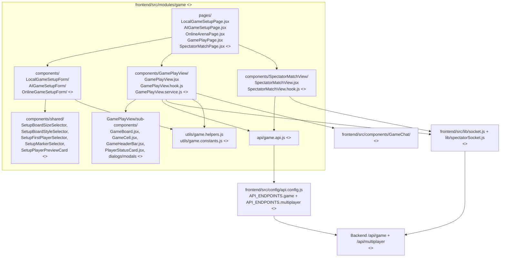

### Admin Module

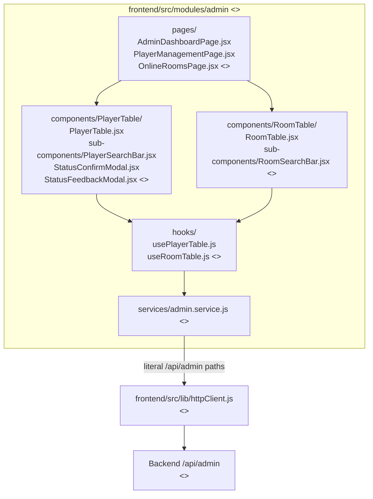

### Premium Module

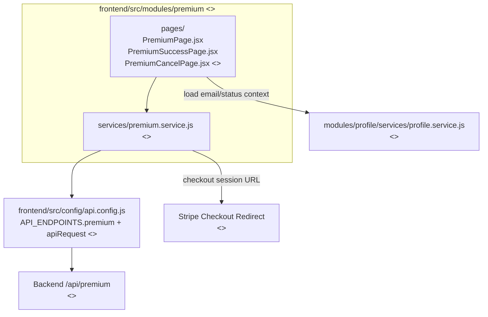

## 5. Low-Level Backend Module Diagrams

### Auth Module

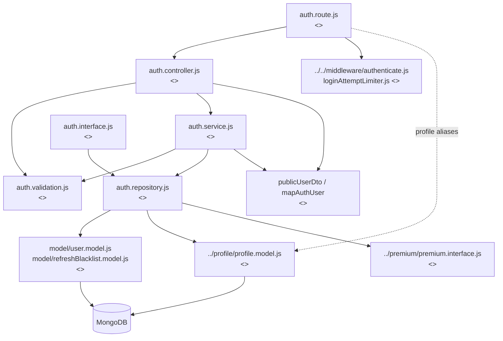

### Profile Module

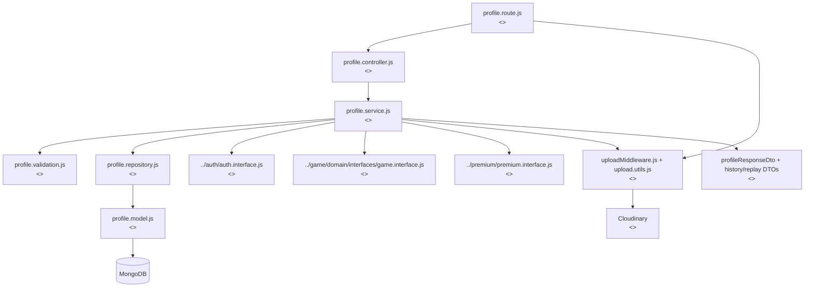

### Admin Module

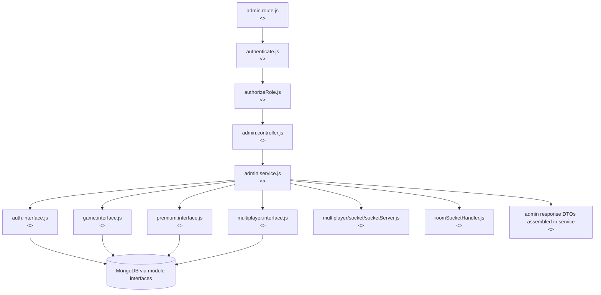

### Game Module

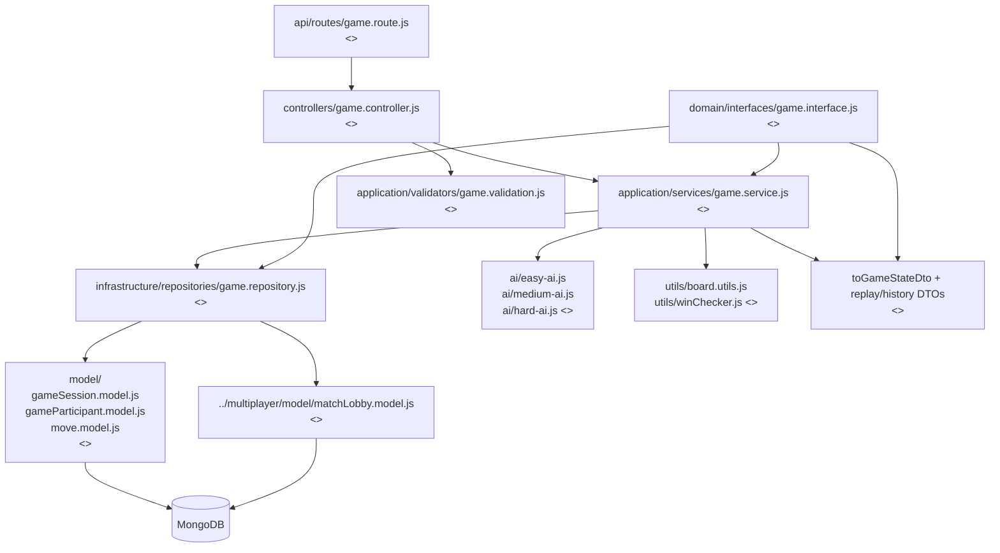

### Premium Module

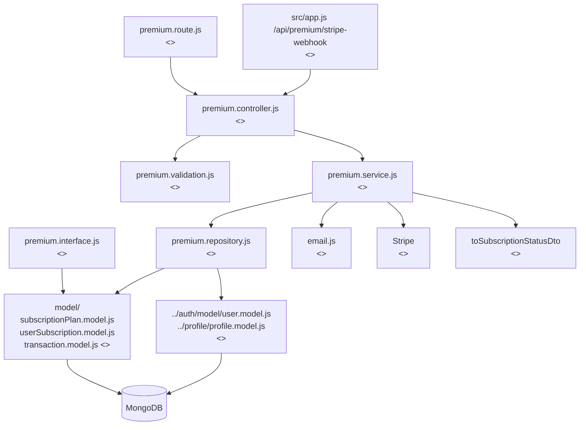

### Wallet Module

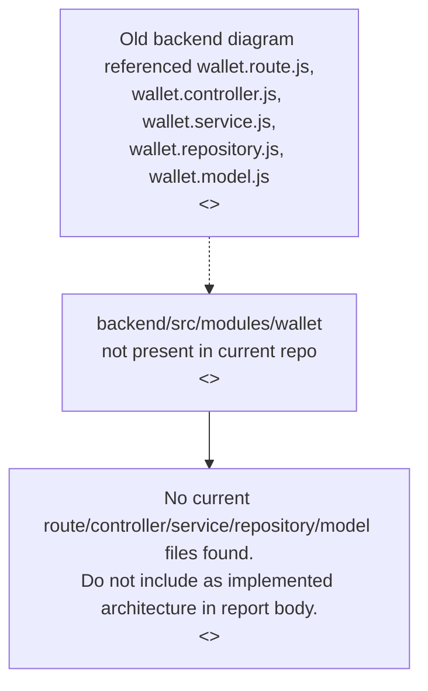

### Multiplayer Module

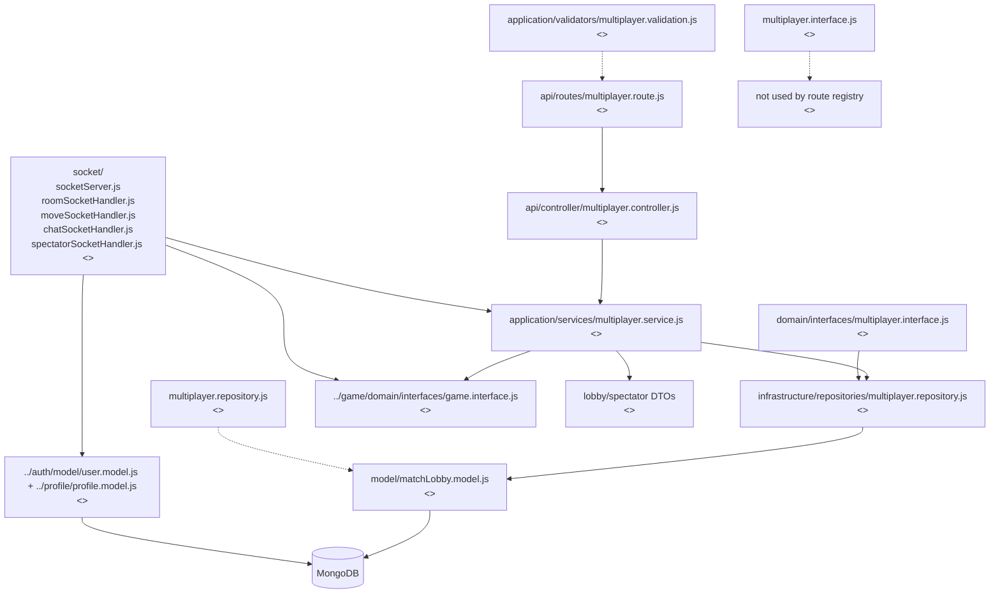

## Architecture Notes

- The backend is structured as a modular monolith: feature modules live under `backend/src/modules`, share one Express process, and persist through MongoDB/Mongoose.
- The intended backend flow is represented as `Route -> Controller -> Service -> Repository -> Model -> MongoDB`. The `game` and `multiplayer` modules use a more layered folder naming style: `api/routes`, `api/controller` or `controllers`, `application/services`, `infrastructure/repositories`, `domain/interfaces`, and `model`.
- Cross-module communication is mainly intended to go through module interfaces such as `auth.interface.js`, `game.interface.js`, `premium.interface.js`, and `multiplayer/domain/interfaces/multiplayer.interface.js`.
- DTO/response shaping is done inside services and middleware before returning data, for example `publicUserDto`, `profileResponseDto`, `toGameStateDto`, `toSubscriptionStatusDto`, replay/history DTO mapping, and safe `req.user` shaping in `authenticate.js`.
- Authentication and authorization are separated: `authenticate.js` validates Bearer JWTs and token blacklist state, while `authorizeRole.js` enforces allowed roles such as admin routes.
- The frontend follows a feature-module shape where pages render components, components use hooks, hooks call services/API adapters, and those services call backend REST endpoints through either `config/api.config.js` or `lib/httpClient.js`.
- `config/api.config.js` owns API base URL, endpoint constants, token helpers, and an `apiRequest` wrapper. `lib/httpClient.js` is a second REST helper focused on automatic token refresh and HTTP verb helpers.
- Frontend role-based routing is implemented in `ProtectedRoute.jsx` and `RoleRoute.jsx`, with `app/router.jsx` splitting player and admin route trees.

## Diagram Accuracy Check

- No `docs/` folder or repo-local `docs/assets` old diagrams were found before this file was created. The old frontend/backend images supplied in the prompt reference several names that do not fully match this repository.
- The old backend diagram includes wallet and media/user modules. The current backend repo does not contain `backend/src/modules/wallet`, `backend/src/modules/media`, or `backend/src/modules/user`; wallet is shown only as absent because the requested module has no current files.
- The old frontend diagram references files such as `config/constants.js`, `hooks/useResponsive.js`, `filters/gameHistory.filter.js`, `player.filter.js`, and `room.filter.js`; those files were not found in the current frontend tree.
- Some frontend services use `API_ENDPOINTS` from `config/api.config.js` (`auth`, `game`, `premium`), while others hardcode literal `/api/...` paths through `lib/httpClient.js` (`admin`, `profile`). This is an architecture inconsistency against a single API config source.
- There are two REST helper layers: `config/api.config.js` exports `apiRequest`, while `lib/httpClient.js` exports verb helpers and refresh retry behavior. Both are active, which can duplicate responsibility.
- Backend interface-based cross-module communication is present, especially in `admin.service.js`, `profile.service.js`, and `multiplayer.service.js`. Some direct cross-module imports still bypass interfaces: `auth.repository.js` imports `profile.model.js`, `premium.repository.js` imports auth/profile models, `game.repository.js` imports `multiplayer/model/matchLobby.model.js`, and `multiplayer/socket/socketServer.js` imports auth/profile models and auth repository directly.
- `admin` currently has route/controller/service files but no module-local repository, model, validation, or interface files. It operates as an orchestration module over other module interfaces.
- `profile` has route/controller/service/repository/model/validation files, but no module-local `profile.interface.js`.
- `multiplayer` contains the intended layered files and socket handlers, plus top-level `multiplayer.repository.js` and `multiplayer.interface.js` files that appear separate from the route-registered layered path.
- `config/db.js` exists, but `server.js` currently connects to MongoDB directly with `mongoose.connect(...)` instead of using that helper.
- No empty backend or frontend source files were found during inspection.
